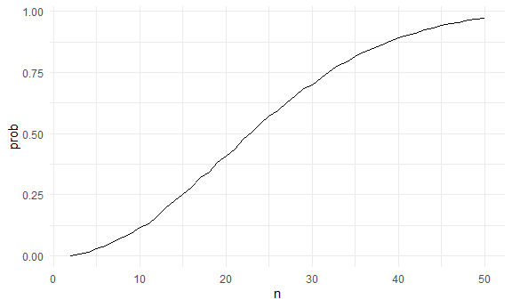
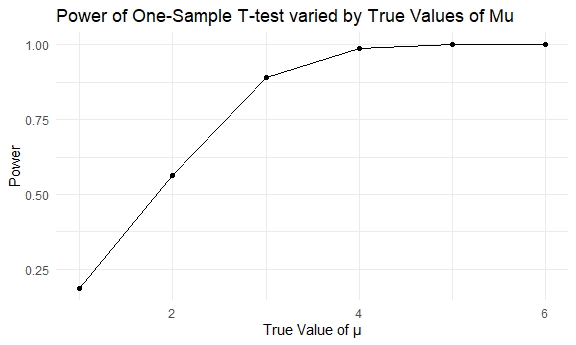
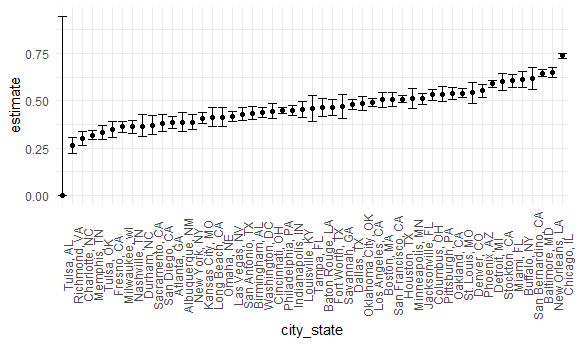

HW 5
================

``` r
library(tidyverse)
```

    ## ── Attaching core tidyverse packages ──────────────────────── tidyverse 2.0.0 ──
    ## ✔ dplyr     1.1.4     ✔ readr     2.1.5
    ## ✔ forcats   1.0.0     ✔ stringr   1.5.1
    ## ✔ ggplot2   3.5.1     ✔ tibble    3.2.1
    ## ✔ lubridate 1.9.3     ✔ tidyr     1.3.1
    ## ✔ purrr     1.0.2     
    ## ── Conflicts ────────────────────────────────────────── tidyverse_conflicts() ──
    ## ✖ dplyr::filter() masks stats::filter()
    ## ✖ dplyr::lag()    masks stats::lag()
    ## ℹ Use the conflicted package (<http://conflicted.r-lib.org/>) to force all conflicts to become errors

``` r
knitr::opts_chunk$set(
  fig.width = 6,
  fig.asp = .6,
  out.width = "90%"
)

theme_set(theme_minimal() + theme(legend.position = "bottom"))

options(
  ggplot2.continuous.colour = "viridis",
  ggplot2.continuous.fill = "viridis"
)

scale_colour_discrete = scale_colour_viridis_d
scale_fill_discrete = scale_fill_viridis_d
```

Load key packages

``` r
library(tidyverse)
library(broom)
library(purrr)
set.seed(1000)
```

## Problem 1

Writing a function that for a fixed group size randomly draws
“birthdays” for each person, checks whether there are duplicate
birthdays in the group, and returns TRUE or FALSE based on the result.

``` r
bday_sim = function(n) {
  
  bdays = sample(1:365, size = n, replace = TRUE)
  
  duplicate = length(unique(bdays)) < n #check for any duplicates, and FALSE if <n
  
  return(duplicate)
  
}

bday_sim(30)
```

    ## [1] TRUE

Iterating 10000 times for each group size between 2 and 50. Then, for
each group size, computing the probability that at least two people in
the group will share a birthday by averaging across the 10000 simulation
runs.

``` r
sim_res = 
  expand_grid(
    n = c(2:50),
    iter = 1:10000
  ) |> 
  mutate(res = map_lgl(n, bday_sim)) |> 
  group_by(n) |> 
    summarize(prob = mean(res))
```

Making a plot showing the probability as a function of group size.

``` r
sim_res |> 
  ggplot(aes(x = n, y = prob )) +
  geom_line()
```



The shape of the function is a sigmoid function. Larger the group size,
higher the probability of at least two people in a group sharing a same
birthday.

## Problem 2

Fixing n=30 and σ=5. Setting μ=0. Generating 5000 datasets from the
model.

``` r
sim_t = function(n = 30, mu = mu, sigma = 5) {
  
  sim_data = tibble(
    x = rnorm(n, mean = mu, sd = sigma)
  )
 
  sim_t_results = broom::tidy(t.test(sim_data$x)
    )
}

sim_results_df = 
  expand_grid(
    mu = 0,
    iter = 1:5000
  ) |> 
  mutate(estimate_df = map(mu, ~ sim_t(mu = .x))) |> 
  unnest(estimate_df)

sim_results_df
```

    ## # A tibble: 5,000 × 10
    ##       mu  iter estimate statistic p.value parameter conf.low conf.high method   
    ##    <dbl> <int>    <dbl>     <dbl>   <dbl>     <dbl>    <dbl>     <dbl> <chr>    
    ##  1     0     1  -0.236    -0.214    0.832        29   -2.49       2.02 One Samp…
    ##  2     0     2  -0.267    -0.324    0.749        29   -1.95       1.42 One Samp…
    ##  3     0     3  -0.552    -0.631    0.533        29   -2.34       1.24 One Samp…
    ##  4     0     4  -0.485    -0.508    0.615        29   -2.44       1.47 One Samp…
    ##  5     0     5  -0.156    -0.183    0.856        29   -1.90       1.59 One Samp…
    ##  6     0     6  -0.352    -0.381    0.706        29   -2.24       1.53 One Samp…
    ##  7     0     7  -0.0912   -0.0737   0.942        29   -2.62       2.44 One Samp…
    ##  8     0     8  -0.380    -0.471    0.641        29   -2.03       1.27 One Samp…
    ##  9     0     9   1.29      1.38     0.179        29   -0.626      3.21 One Samp…
    ## 10     0    10   0.0360    0.0462   0.963        29   -1.56       1.63 One Samp…
    ## # ℹ 4,990 more rows
    ## # ℹ 1 more variable: alternative <chr>

Repeat the above for μ={1,2,3,4,5,6}

``` r
sim_results_other_df =
  expand_grid(
    mu = c(1, 2, 3, 4, 5, 6),
    iter = 1:5000
  ) |> 
  mutate(estimate_df = map(mu, ~sim_t(mu = .x))) |> 
  unnest(estimate_df)
```

Making a plot showing the proportion of times the null was rejected (the
power of the test) on the y axis and the true value of μ on the x axis.

``` r
sim_results_other_df |> 
  group_by(mu) |> 
  summarize(
    rejects = sum(p.value <= 0.05), total_ct = n(), 
    power = rejects/total_ct
  ) |> 
  ggplot(aes(x = mu, y = power)) +
  geom_point() +
  geom_line() +
  labs(x = "True Value of μ", y = "Power", title = "Power of One-Sample T-test varied by True Values of Mu")
```



Greater effect size is associated with larger power of the t-test.

## Problem 3

Creating a `city_state` variable, tidying, and summarizing within cities
to obtain the total number of homicides and the number of unsolved
homicides.

``` r
homicide_df = 
  read_csv("data/homicide-data.csv", na = c("", "NA", "Unknown")) |> 
  mutate(
    city_state = str_c(city, state, sep = ", "),
    outcome = 
      ifelse(disposition %in% c("Closed without arrest", "Open/No arrest"), "unsolved", "solved")
    )
```

    ## Rows: 52179 Columns: 12
    ## ── Column specification ────────────────────────────────────────────────────────
    ## Delimiter: ","
    ## chr (8): uid, victim_last, victim_first, victim_race, victim_sex, city, stat...
    ## dbl (4): reported_date, victim_age, lat, lon
    ## 
    ## ℹ Use `spec()` to retrieve the full column specification for this data.
    ## ℹ Specify the column types or set `show_col_types = FALSE` to quiet this message.

The dataframe `homicide_df` has 52179 rows and 14 columns representing
more than 52000 criminal homicides over the past decade in 50 of the
largest American cities, obtained by Washington Post. The data includes
the id, date, location of homicide, demographic information about the
victim, `city_state` variable that describes city and state, and
`outcome` variable describing the whether an arrest was made.

Obtaining the total number of homicides and the number of unsolved
homicides by `city_state`.

``` r
homicide_city_df =
homicide_df |> 
  group_by(city_state) |> 
  summarize(
    total_homicides = n(),
    unsolved_homicides = sum(outcome == "unsolved")
  )
```

For the city of Baltimore, MD, estimating the proportion of homicides
that are unsolved; saving the output of prop.test as an R object,
applying the broom::tidy to this object and pulling the estimated
proportion and confidence intervals from the resulting tidy dataframe.

``` r
baltimore_prop = 
  prop.test(
    x = filter(homicide_city_df, city_state == "Baltimore, MD") |> 
      pull(unsolved_homicides),
    n = filter(homicide_city_df, city_state == "Baltimore, MD") |> 
      pull(total_homicides)
  )

broom::tidy(baltimore_prop) |> 
  knitr::kable(digits = 4)
```

| estimate | statistic | p.value | parameter | conf.low | conf.high | method                                               | alternative |
|---------:|----------:|--------:|----------:|---------:|----------:|:-----------------------------------------------------|:------------|
|   0.6456 |   239.011 |       0 |         1 |   0.6276 |    0.6632 | 1-sample proportions test with continuity correction | two.sided   |

Using `purrr` package to run prop.test for each of the cities and
extracting both the proportion of `unsolved_homicides` and the
confidence interval.

``` r
homicide_plot = 
homicide_city_df |> 
  mutate(
    props = map2(unsolved_homicides, total_homicides, \(x, y) prop.test(x = x, n = y)),
    tidy_props = map(props, broom::tidy)
  ) |> 
  unnest(tidy_props) |> 
  select(city_state, estimate, conf.low, conf.high)
```

    ## Warning: There was 1 warning in `mutate()`.
    ## ℹ In argument: `props = map2(...)`.
    ## Caused by warning in `prop.test()`:
    ## ! Chi-squared approximation may be incorrect

Creating a plot that shows the estimates and CIs for each city,
organized according to the proportion of unsolved homicides.

``` r
homicide_plot |> 
  mutate(city_state = fct_reorder(city_state, estimate)) |> 
  ggplot(aes(x = city_state, y = estimate)) +
  geom_point() +
  geom_errorbar(aes(ymin = conf.low, ymax = conf.high)) +
  theme(axis.text.x = element_text(angle = 90))
```


